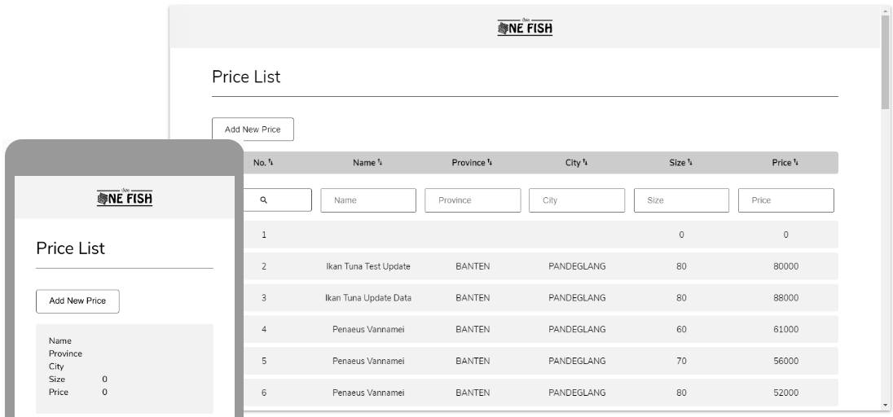

# ONE FISH
One Fish is an online platform to review fish stock market data since October 20, 1999. You can check the official release every Monday.

[Live demo available here](https://flamboyant-hypatia-dd49e9.netlify.app/)

## Features

- One Fish available for both desktop and mobile view

### General
- You can create new list by clicking on the 'Add New Price' Button
- On the first load, the app will show the first 40 data, and you can load more data by click on 'Load More' on the bottom of the table

### Desktop Only Features
- You can search for specific data by enter the keyword to the input field on the top of each column, then click the search icon  on the left of the row. Search only available for the exact full string.
- Sort data can be done by clicking the header of each column. And also you can change the order by clicking again on that header. Take note that the sorting only happen to the loaded data. On load more, the table will resort using the current rule.

### Mobile Only Feature
- none

